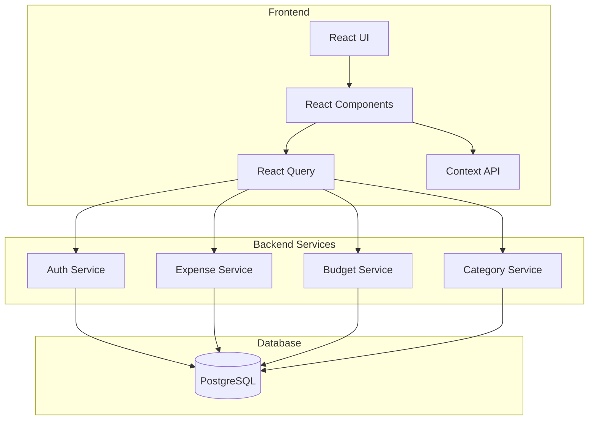
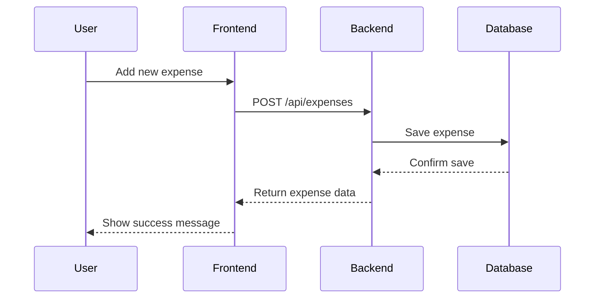
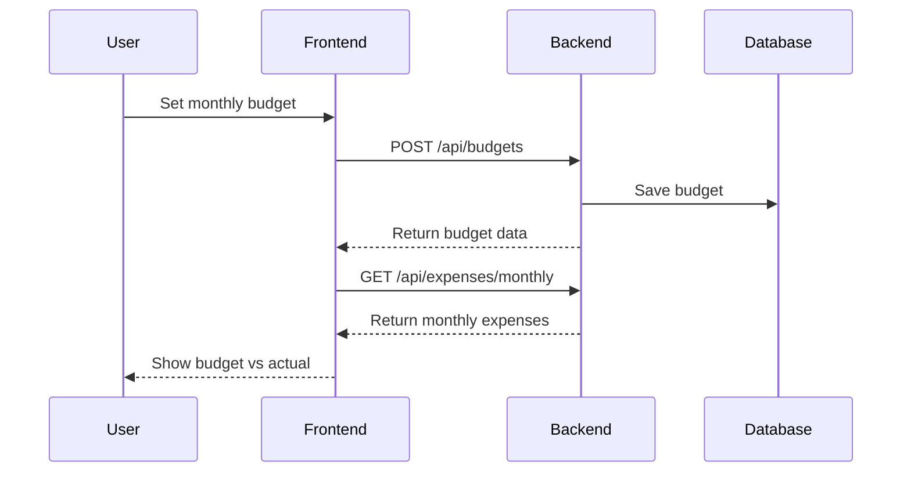
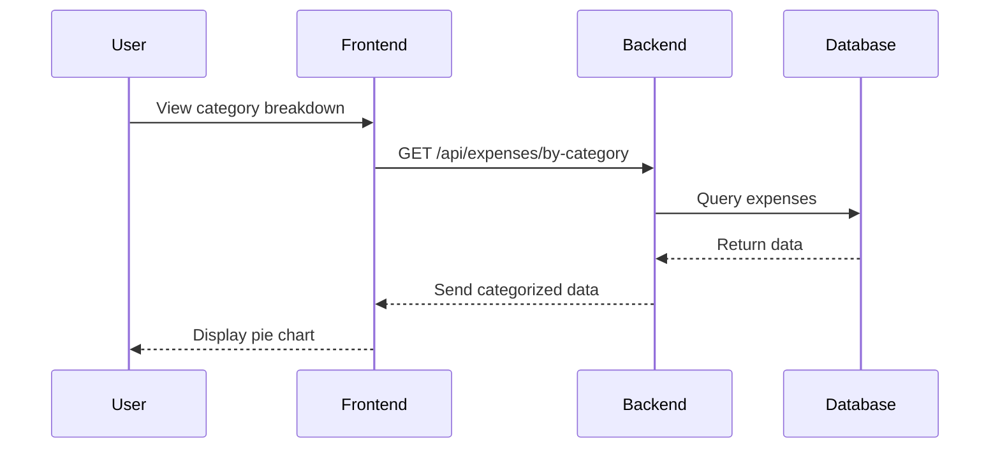

# RoboBudget - Personal Finance Assistant

RoboBudget is a modern personal finance application that helps users track expenses, manage budgets, and make informed financial decisions.

## 🏗 Project Architecture



## 🚀 Features

### Authentication & User Management
- Secure user registration and login
- JWT-based authentication
- Protected routes and API endpoints

### Expense Tracking
- Add, edit, and delete expenses
- Categorize expenses
- View expense history
- Filter and sort expenses

### Budget Management
- Set monthly budgets
- Track budget vs actual spending
- Budget alerts and notifications
- Category-wise budget allocation

### Dashboard & Analytics
- Monthly spending overview
- Category-wise expense breakdown
- Income vs Expense visualization
- Spending trends analysis

## 💻 Technology Stack

### Frontend
- React with TypeScript
- Material-UI for styling
- React Query for data fetching
- Context API for state management
- Recharts for data visualization

### Backend
- Ruby on Rails API
- JWT authentication
- PostgreSQL database
- RESTful API design

## 🎯 Example Scenarios

### 1. Expense Tracking


### 2. Budget Management


### 3. Category Analysis


## 🛠 Setup & Installation

### Prerequisites
- Node.js >= 14
- Ruby 2.6.10
- PostgreSQL >= 12
- Yarn or npm

### Frontend Setup
```bash
cd frontend-web
yarn install
yarn start
```

### Backend Setup
```bash
cd services/auth_service
bundle install
rails db:create db:migrate
rails s -p 3001
```


### Dashboard

- Monthly overview
- Recent transactions
- Budget status

### Expense Management

- Transaction list
- Add/Edit expenses
- Category filters

### Budget Planning

- Budget allocation
- Spending limits
- Category budgets

## 🔒 Security

- JWT-based authentication
- Password encryption
- CORS protection
- API rate limiting
- Input validation
